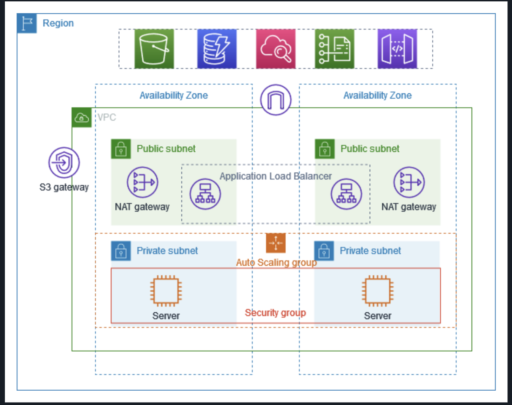

🚀 Production-Grade Multi-AZ AWS Architecture with Private Subnet Isolation
===========================================================================

📌 Overview
-----------

This project demonstrates the design and implementation of a **highly available, fault-tolerant AWS infrastructure** built across multiple Availability Zones using secure subnet segmentation, zonal NAT routing, and load-balanced private compute.

The architecture follows production-grade best practices by eliminating single points of failure and isolating application servers within private subnets.

🏗 Architecture Diagram
----------------------- 

🧱 Infrastructure Components
----------------------------

*   1 Virtual Private Cloud (VPC)
    
*   2 Public Subnets (across 2 Availability Zones)
    
*   2 Private Subnets (across 2 Availability Zones)
    
*   Internet Gateway (IGW)
    
*   1 NAT Gateway per Availability Zone
    
*   Application Load Balancer (ALB)
    
*   Auto Scaling Group (ASG)
    
*   EC2 instances in Private Subnets
    
*   S3 Gateway Endpoint
    
*   Security Groups for layered access control
    

🌐 Traffic Flow
---------------

### 🔹 Inbound Traffic (User → Application)

Plain textANTLR4BashCC#CSSCoffeeScriptCMakeDartDjangoDockerEJSErlangGitGoGraphQLGroovyHTMLJavaJavaScriptJSONJSXKotlinLaTeXLessLuaMakefileMarkdownMATLABMarkupObjective-CPerlPHPPowerShell.propertiesProtocol BuffersPythonRRubySass (Sass)Sass (Scss)SchemeSQLShellSwiftSVGTSXTypeScriptWebAssemblyYAMLXML`   Internet   → Internet Gateway       → Application Load Balancer (Public Subnets)           → Target Group               → Auto Scaling EC2 Instances (Private Subnets)   `

*   ALB distributes traffic across instances in multiple AZs.
    
*   Health checks ensure automatic failover.
    
*   Private EC2 instances do not have public IP addresses.
    

### 🔹 Outbound Traffic (Private Instances → Internet)

Plain textANTLR4BashCC#CSSCoffeeScriptCMakeDartDjangoDockerEJSErlangGitGoGraphQLGroovyHTMLJavaJavaScriptJSONJSXKotlinLaTeXLessLuaMakefileMarkdownMATLABMarkupObjective-CPerlPHPPowerShell.propertiesProtocol BuffersPythonRRubySass (Sass)Sass (Scss)SchemeSQLShellSwiftSVGTSXTypeScriptWebAssemblyYAMLXML`   Private EC2   → Route Table       → NAT Gateway (Same AZ)           → Internet Gateway               → Internet   `

*   Each private subnet routes to a NAT Gateway within the same AZ.
    
*   Prevents cross-AZ dependency.
    
*   Ensures fault-tolerant outbound internet access.
    

### 🔹 Private S3 Access

Plain textANTLR4BashCC#CSSCoffeeScriptCMakeDartDjangoDockerEJSErlangGitGoGraphQLGroovyHTMLJavaJavaScriptJSONJSXKotlinLaTeXLessLuaMakefileMarkdownMATLABMarkupObjective-CPerlPHPPowerShell.propertiesProtocol BuffersPythonRRubySass (Sass)Sass (Scss)SchemeSQLShellSwiftSVGTSXTypeScriptWebAssemblyYAMLXML`   Private EC2   → S3 Gateway Endpoint       → Amazon S3   `

*   Enables secure S3 access without traversing the public internet.
    
*   Reduces NAT bandwidth usage.
    
*   Improves security posture.
    

⚡ High Availability Design
--------------------------

*   Multi-AZ public and private subnet deployment
    
*   NAT Gateway per AZ to remove single point of failure
    
*   Load-balanced application tier across AZs
    
*   Auto Scaling Group for horizontal scaling
    
*   Health checks for automatic traffic rerouting
    

This ensures resilience at both the network and application layers.

🔐 Security Architecture
------------------------

*   No public IP assigned to private EC2 instances
    
*   Application Load Balancer as the only public entry point
    
*   Subnet-level network segmentation
    
*   Security Groups controlling tier-to-tier communication
    
*   Controlled outbound access via NAT Gateway
    

Public attack surface reduced by 100% at compute layer.

📊 Quantifiable Impact
----------------------

*   Architected a 4-subnet, 2-AZ production-style infrastructure
    
*   Eliminated single points of failure at NAT and application layer
    
*   Reduced direct public exposure of compute resources to zero
    
*   Enabled automated failover and horizontal scalability via ASG
    

🧠 Key Learning Outcomes
------------------------

*   Deep understanding of VPC routing and subnet isolation
    
*   Zonal NAT Gateway design strategy
    
*   Application Load Balancer configuration and health checks
    
*   Multi-AZ high availability architecture
    
*   Private endpoint integration using S3 Gateway Endpoint
    
*   End-to-end traffic flow debugging and troubleshooting
    

🔄 Future Improvements
----------------------

*   Convert entire infrastructure to Terraform (Infrastructure as Code)
    
*   Implement AWS Systems Manager (SSM) instead of Bastion
    
*   Add centralized logging with CloudWatch
    
*   Add monitoring and alerting
    
*   Integrate CI/CD pipeline for automated deployment
    

🎯 Project Summary
------------------

This project reflects a real-world, production-oriented AWS networking architecture emphasizing:

*   High availability
    
*   Security isolation
    
*   Fault tolerance
    
*   Scalability
    
*   Controlled egress
    

Designed with cloud engineering best practices in mind.
